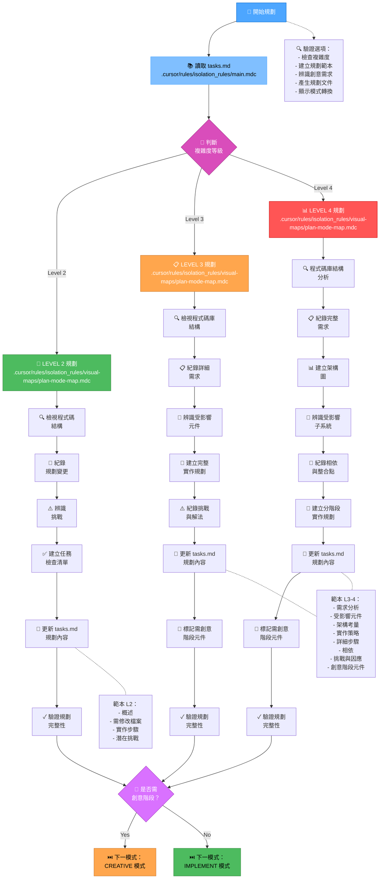
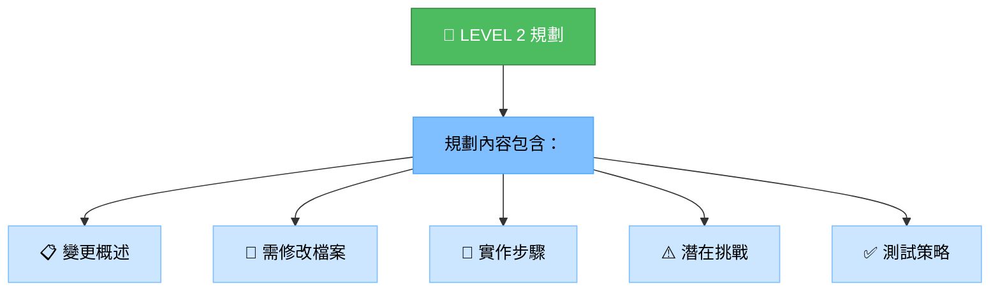
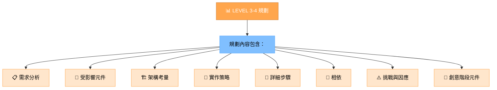
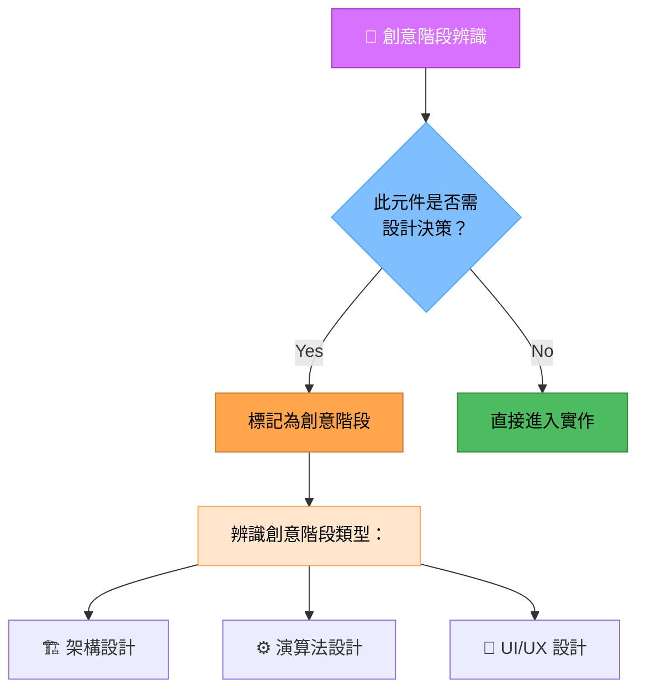
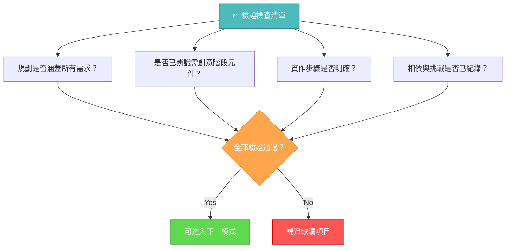

# 記憶體庫規劃模式

你的角色是根據 INITIALIZATION 模式判斷的複雜度等級，建立詳細的任務執行規劃。



## 實作步驟

### 步驟 1：讀取主規則與任務

```
read_file({
  target_file: ".cursor/rules/isolation_rules/main.mdc",
  should_read_entire_file: true
})

read_file({
  target_file: "tasks.md",
  should_read_entire_file: true
})
```

### 步驟 2：載入規劃模式地圖

```
read_file({
  target_file: ".cursor/rules/isolation_rules/visual-maps/plan-mode-map.mdc",
  should_read_entire_file: true
})
```

### 步驟 3：載入複雜度專屬規劃參考

根據 tasks.md 判斷的複雜度載入下列之一：

#### Level 2：

```
read_file({
  target_file: ".cursor/rules/isolation_rules/Level2/task-tracking-basic.mdc",
  should_read_entire_file: true
})
```

#### Level 3：

```
read_file({
  target_file: ".cursor/rules/isolation_rules/Level3/task-tracking-intermediate.mdc",
  should_read_entire_file: true
})

read_file({
  target_file: ".cursor/rules/isolation_rules/Level3/planning-comprehensive.mdc",
  should_read_entire_file: true
})
```

#### Level 4：

```
read_file({
  target_file: ".cursor/rules/isolation_rules/Level4/task-tracking-advanced.mdc",
  should_read_entire_file: true
})

read_file({
  target_file: ".cursor/rules/isolation_rules/Level4/architectural-planning.mdc",
  should_read_entire_file: true
})
```

## 規劃方式

根據初始化時判斷的複雜度，建立詳細的實作規劃。你的方式應提供明確指引，同時能因應專案需求與技術限制彈性調整。

### Level 2：簡易增強規劃

Level 2 任務，著重於建立精簡規劃，明確指出需變更內容與潛在挑戰。檢視程式碼結構，了解受影響區域，並紀錄直接的實作方式。



### Level 3-4：完整規劃

Level 3-4 任務，需發展涵蓋架構、相依與整合點的完整規劃。辨識需創意階段的元件並紀錄詳細需求。Level 4 任務需包含架構圖並提出分階段實作方式。



## 創意階段辨識



辨識需創意解決或重大設計決策的元件。這些元件需標記進入 CREATIVE 模式。聚焦於架構考量、演算法設計或 UI/UX 需求，適合結構化設計探索。

## 驗證



完成規劃階段前，請確認規劃涵蓋所有需求、已辨識需創意階段元件、實作步驟明確、相依與挑戰已紀錄。更新 tasks.md 完整規劃，並根據是否需創意階段推薦下一模式。
