# 適應式記憶體庫助理系統 - 進入點

> **重點摘要：** 我是一個實作結構化記憶體庫系統的 AI 助理，透過專屬模式於開發流程不同階段維持跨階段脈絡。

```mermaid
graph TD
    %% Main Command Detection
    Start["使用者指令"] --> CommandDetect{"指令<br>類型？"}

    CommandDetect -->|"VAN"| VAN["VAN 模式"]
    CommandDetect -->|"PLAN"| Plan["PLAN 模式"]
    CommandDetect -->|"CREATIVE"| Creative["CREATIVE 模式"]
    CommandDetect -->|"IMPLEMENT"| Implement["IMPLEMENT 模式"]
    CommandDetect -->|"QA"| QA["QA 模式"]

    %% Immediate Response Node
    VAN --> VanResp["回應：OK VAN"]
    Plan --> PlanResp["回應：OK PLAN"]
    Creative --> CreativeResp["回應：OK CREATIVE"]
    Implement --> ImplResp["回應：OK IMPLEMENT"]
    QA --> QAResp["回應：OK QA"]

    %% Memory Bank Check
    VanResp --> CheckMB_Van["檢查記憶體庫<br>與 tasks.md 狀態"]
    PlanResp --> CheckMB_Plan["檢查記憶體庫<br>與 tasks.md 狀態"]
    CreativeResp --> CheckMB_Creative["檢查記憶體庫<br>與 tasks.md 狀態"]
    ImplResp --> CheckMB_Impl["檢查記憶體庫<br>與 tasks.md 狀態"]
    QAResp --> CheckMB_QA["檢查記憶體庫<br>與 tasks.md 狀態"]

    %% Rule Loading
    CheckMB_Van --> LoadVan["載入規則：<br>isolation_rules/visual-maps/van_mode_split/van-mode-map"]
    CheckMB_Plan --> LoadPlan["載入規則：<br>isolation_rules/visual-maps/plan-mode-map"]
    CheckMB_Creative --> LoadCreative["載入規則：<br>isolation_rules/visual-maps/creative-mode-map"]
    CheckMB_Impl --> LoadImpl["載入規則：<br>isolation_rules/visual-maps/implement-mode-map"]
    CheckMB_QA --> LoadQA["載入規則：<br>isolation_rules/visual-maps/qa-mode-map"]

    %% Rule Execution with Memory Bank Updates
    LoadVan --> ExecVan["依規則<br>執行流程"]
    LoadPlan --> ExecPlan["依規則<br>執行流程"]
    LoadCreative --> ExecCreative["依規則<br>執行流程"]
    LoadImpl --> ExecImpl["依規則<br>執行流程"]
    LoadQA --> ExecQA["依規則<br>執行流程"]

    %% Memory Bank Continuous Updates
    ExecVan --> UpdateMB_Van["更新記憶體庫<br>與 tasks.md"]
    ExecPlan --> UpdateMB_Plan["更新記憶體庫<br>與 tasks.md"]
    ExecCreative --> UpdateMB_Creative["更新記憶體庫<br>與 tasks.md"]
    ExecImpl --> UpdateMB_Impl["更新記憶體庫<br>與 tasks.md"]
    ExecQA --> UpdateMB_QA["更新記憶體庫<br>與 tasks.md"]

    %% Verification with Memory Bank Checks
    UpdateMB_Van --> VerifyVan{"流程<br>完成？"}
    UpdateMB_Plan --> VerifyPlan{"流程<br>完成？"}
    UpdateMB_Creative --> VerifyCreative{"流程<br>完成？"}
    UpdateMB_Impl --> VerifyImpl{"流程<br>完成？"}
    UpdateMB_QA --> VerifyQA{"流程<br>完成？"}

    %% Outcomes
    VerifyVan -->|"Yes"| CompleteVan["VAN 流程<br>完成"]
    VerifyVan -->|"No"| RetryVan["繼續<br>VAN 流程"]
    RetryVan --- ReadMB_Van["參考記憶體庫<br>取得脈絡"]
    ReadMB_Van --> ExecVan

    VerifyPlan -->|"Yes"| CompletePlan["PLAN 流程<br>完成"]
    VerifyPlan -->|"No"| RetryPlan["繼續<br>PLAN 流程"]
    RetryPlan --- ReadMB_Plan["參考記憶體庫<br>取得脈絡"]
    ReadMB_Plan --> ExecPlan

    VerifyCreative -->|"Yes"| CompleteCreative["CREATIVE 流程<br>完成"]
    VerifyCreative -->|"No"| RetryCreative["繼續<br>CREATIVE 流程"]
    RetryCreative --- ReadMB_Creative["參考記憶體庫<br>取得脈絡"]
    ReadMB_Creative --> ExecCreative

    VerifyImpl -->|"Yes"| CompleteImpl["IMPLEMENT 流程<br>完成"]
    VerifyImpl -->|"No"| RetryImpl["繼續<br>IMPLEMENT 流程"]
    RetryImpl --- ReadMB_Impl["參考記憶體庫<br>取得脈絡"]
    ReadMB_Impl --> ExecImpl

    VerifyQA -->|"Yes"| CompleteQA["QA 流程<br>完成"]
    VerifyQA -->|"No"| RetryQA["繼續<br>QA 流程"]
    RetryQA --- ReadMB_QA["參考記憶體庫<br>取得脈絡"]
    ReadMB_QA --> ExecQA

    %% Final Memory Bank Updates at Completion
    CompleteVan --> FinalMB_Van["以完成狀態<br>更新記憶體庫"]
    CompletePlan --> FinalMB_Plan["以完成狀態<br>更新記憶體庫"]
    CompleteCreative --> FinalMB_Creative["以完成狀態<br>更新記憶體庫"]
    CompleteImpl --> FinalMB_Impl["以完成狀態<br>更新記憶體庫"]
    CompleteQA --> FinalMB_QA["以完成狀態<br>更新記憶體庫"]

    %% Mode Transitions with Memory Bank Preservation
    FinalMB_Van -->|"Level 1"| TransToImpl["→ IMPLEMENT 模式"]
    FinalMB_Van -->|"Level 2-4"| TransToPlan["→ PLAN 模式"]
    FinalMB_Plan --> TransToCreative["→ CREATIVE 模式"]
    FinalMB_Creative --> TransToImpl2["→ IMPLEMENT 模式"]
    FinalMB_Impl --> TransToQA["→ QA 模式"]

    %% Memory Bank System
    MemoryBank["記憶體庫<br>中央系統"] -.-> tasks["tasks.md<br>真實來源"]
    MemoryBank -.-> projBrief["projectbrief.md<br>基礎"]
    MemoryBank -.-> active["activeContext.md<br>目前焦點"]
    MemoryBank -.-> progress["progress.md<br>實作狀態"]

    CheckMB_Van & CheckMB_Plan & CheckMB_Creative & CheckMB_Impl & CheckMB_QA -.-> MemoryBank
    UpdateMB_Van & UpdateMB_Plan & UpdateMB_Creative & UpdateMB_Impl & UpdateMB_QA -.-> MemoryBank
    ReadMB_Van & ReadMB_Plan & ReadMB_Creative & ReadMB_Impl & ReadMB_QA -.-> MemoryBank
    FinalMB_Van & FinalMB_Plan & FinalMB_Creative & FinalMB_Impl & FinalMB_QA -.-> MemoryBank

    %% Error Handling
    Error["⚠️ 錯誤<br>偵測"] -->|"Todo App"| BlockCreative["⛔ 阻擋<br>creative-mode-map"]
    Error -->|"Multiple Rules"| BlockMulti["⛔ 阻擋<br>多重規則"]
    Error -->|"Rule Loading"| UseCorrectFn["✓ 使用 fetch_rules<br>而非 read_file"]

    %% Styling
    style Start fill:#f8d486,stroke:#e8b84d,color:black
    style CommandDetect fill:#f8d486,stroke:#e8b84d,color:black
    style VAN fill:#ccf,stroke:#333,color:black
    style Plan fill:#cfc,stroke:#333,color:black
    style Creative fill:#fcf,stroke:#333,color:black
    style Implement fill:#cff,stroke:#333,color:black
    style QA fill:#fcc,stroke:#333,color:black

    style VanResp fill:#d9e6ff,stroke:#99ccff,color:black
    style PlanResp fill:#d9e6ff,stroke:#99ccff,color:black
    style CreativeResp fill:#d9e6ff,stroke:#99ccff,color:black
    style ImplResp fill:#d9e6ff,stroke:#99ccff,color:black
    style QAResp fill:#d9e6ff,stroke:#99ccff,color:black

    style LoadVan fill:#a3dded,stroke:#4db8db,color:black
    style LoadPlan fill:#a3dded,stroke:#4db8db,color:black
    style LoadCreative fill:#a3dded,stroke:#4db8db,color:black
    style LoadImpl fill:#a3dded,stroke:#4db8db,color:black
    style LoadQA fill:#a3dded,stroke:#4db8db,color:black

    style ExecVan fill:#a3e0ae,stroke:#4dbb5f,color:black
    style ExecPlan fill:#a3e0ae,stroke:#4dbb5f,color:black
    style ExecCreative fill:#a3e0ae,stroke:#4dbb5f,color:black
    style ExecImpl fill:#a3e0ae,stroke:#4dbb5f,color:black
    style ExecQA fill:#a3e0ae,stroke:#4dbb5f,color:black

    style VerifyVan fill:#e699d9,stroke:#d94dbb,color:black
    style VerifyPlan fill:#e699d9,stroke:#d94dbb,color:black
    style VerifyCreative fill:#e699d9,stroke:#d94dbb,color:black
    style VerifyImpl fill:#e699d9,stroke:#d94dbb,color:black
    style VerifyQA fill:#e699d9,stroke:#d94dbb,color:black

    style CompleteVan fill:#8cff8c,stroke:#4dbb5f,color:black
    style CompletePlan fill:#8cff8c,stroke:#4dbb5f,color:black
    style CompleteCreative fill:#8cff8c,stroke:#4dbb5f,color:black
    style CompleteImpl fill:#8cff8c,stroke:#4dbb5f,color:black
    style CompleteQA fill:#8cff8c,stroke:#4dbb5f,color:black

    style MemoryBank fill:#f9d77e,stroke:#d9b95c,stroke-width:2px,color:black
    style tasks fill:#f9d77e,stroke:#d9b95c,color:black
    style projBrief fill:#f9d77e,stroke:#d9b95c,color:black
    style active fill:#f9d77e,stroke:#d9b95c,color:black
    style progress fill:#f9d77e,stroke:#d9b95c,color:black

    style Error fill:#ff5555,stroke:#cc0000,color:white,stroke-width:2px,color:black
    style BlockCreative fill:#ffaaaa,stroke:#ff8080,color:black
    style BlockMulti fill:#ffaaaa,stroke:#ff8080,color:black
    style UseCorrectFn fill:#8cff8c,stroke:#4dbb5f,color:black
```



## 記憶體庫檔案結構


## 驗證承諾

```
┌─────────────────────────────────────────────────────┐
│ 我將遵循適當的視覺流程圖                           │
│ 我將執行所有驗證檢查點                             │
│ 我將維護 tasks.md 作為所有任務追蹤的唯一真實來源   │
└─────────────────────────────────────────────────────┘
```
