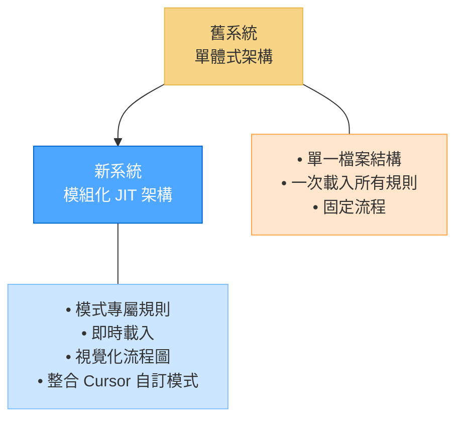
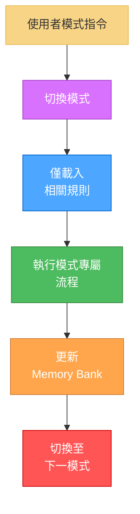
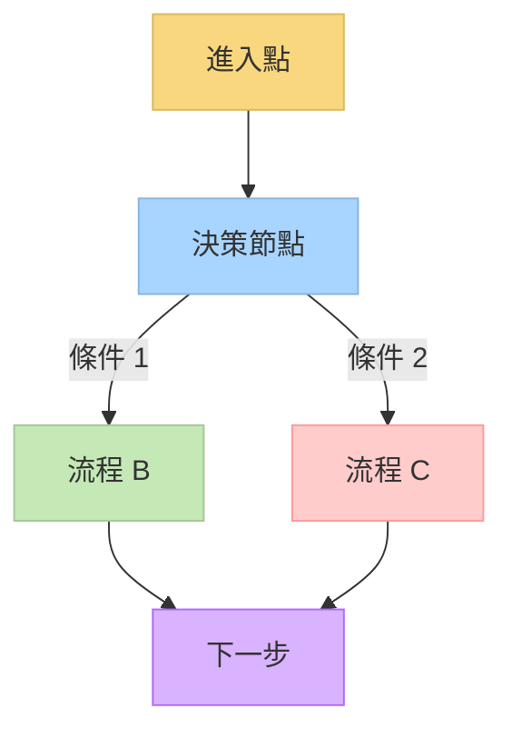
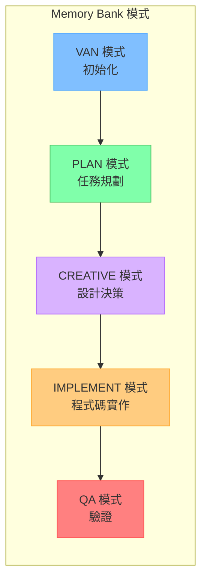
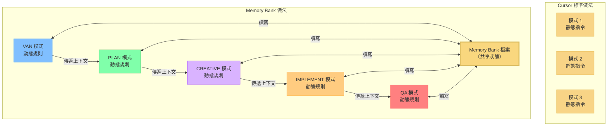
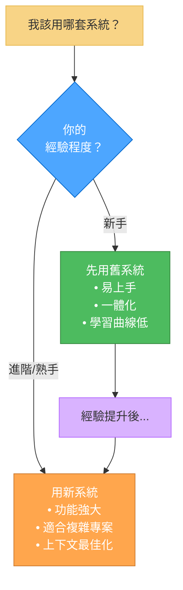
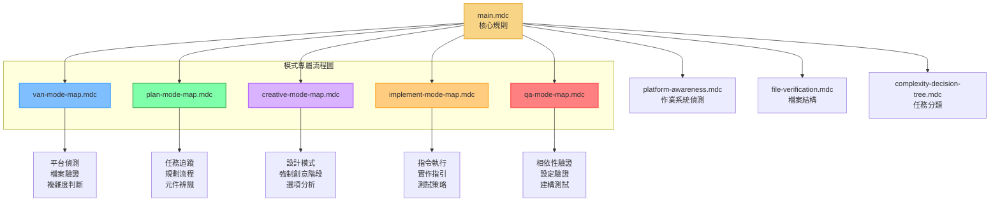
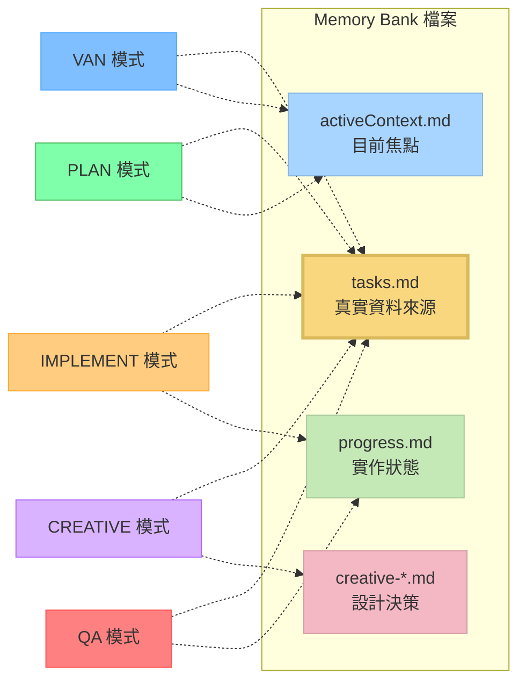
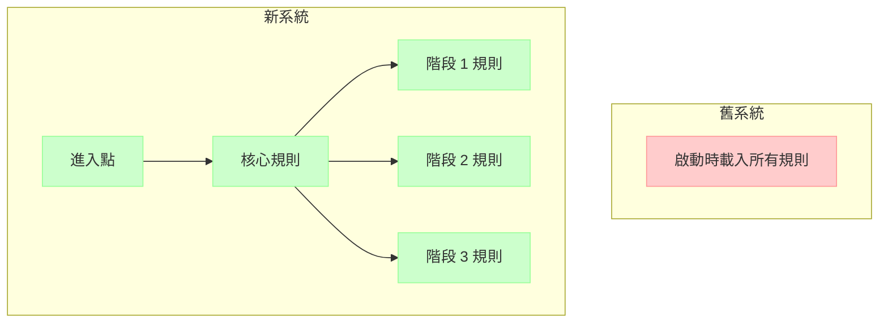
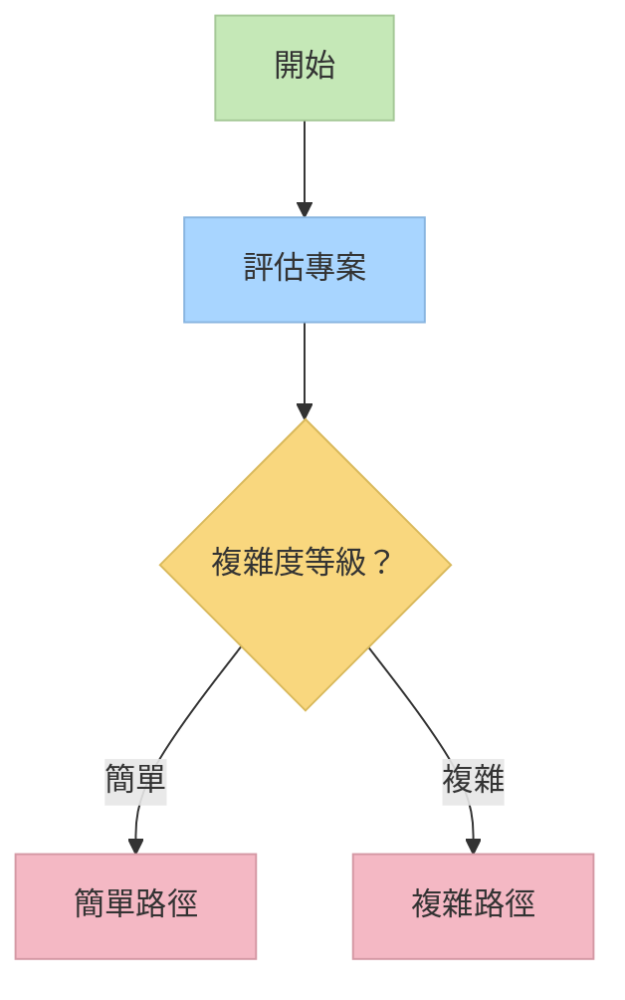

# Memory Bank 系統升級：從單體到模組化

[English](../memory_bank_upgrade_guide.md) | 中文說明

## 前言

我很高興介紹 Memory Bank 系統的一項重大升級——從單體式一體化架構，進化為模組化、圖形導向系統，並整合 Cursor 的自訂模式。本文件說明升級原因、優勢，以及如何充分發揮新系統效益。



## 為何升級

舊版 Memory Bank 系統運作良好，透過自適應複雜度等級與完整文件化，提供結構化任務管理。但隨著專案複雜度提升，我發現以下限制：

1. **上下文效率低**：無論相關與否，一次載入所有規則
2. **缺乏視覺引導**：說明偏重文字，缺少流程圖
3. **Token 浪費**：上下文被無關規則佔據
4. **一體適用**：難以針對不同開發階段調整
5. **延展性挑戰**：單一檔案難以維護日益增長的內容

雖然新系統在效率與延展性上有明顯優勢，但也帶來較高學習曲線。這是有意為之——提升初期複雜度，換取更強大能力、更佳組織與長期開發效益。

## 新的隔離導向架構

新系統以模組化、即時載入（JIT）架構，僅於需要時載入所需規則，解決上述問題。



新系統仍保留原有的 4 級複雜度量表（1 級：快速修 bug，2 級：簡單增強，3 級：中等功能，4 級：複雜系統），作為決定流程路徑與文件需求的核心，確保舊用戶能無縫銜接。

### 新系統重點特色

1. **模式專屬視覺圖**：各開發階段皆有清晰流程圖
2. **即時規則載入**：僅載入當前任務所需規則
3. **視覺決策樹**：流程有明確檢查點
4. **技術驗證**：專屬 QA 流程確保實作就緒
5. **平台感知指令**：自動適應作業系統

### 圖形化效率

新系統的圖形化架構帶來：

- **最佳化路徑導航**：以有向圖高效導引決策樹
- **上下文關聯**：明確建模各階段與元件關係，提升轉換智慧
- **資源最佳化**：每個節點僅載入所需資源
- **平行處理潛力**：易於辨識可平行處理元件



**過去**：線性流程，重複評估規則。

**現在**：依條件最佳化決策路徑，明確合併節點。

此圖形化設計特別適合大型複雜專案，各元件需求與相依性不同，系統能高效導航而不佔用過多上下文。

### CREATIVE 模式與 Claude「Think」工具

新系統的 CREATIVE 模式概念上參考 Anthropic Claude「Think」工具方法論，詳見其 [工程部落格](https://www.anthropic.com/engineering/claude-think-tool)。此法已強化並整合進 Memory Bank 流程：

- **結構化探索**：CREATIVE 模式引導系統性設計選項探索
- **明確推理**：要求記錄各方案優缺點
- **元件拆解**：協助將複雜問題拆解為可管理元件
- **決策文件化**：正式記錄設計決策與理由
- **持續優化**：隨 Claude 能力提升持續改進

此方法對複雜設計決策特別有效，確保所有選項都被充分考慮。

## 整合 Cursor 自訂模式

新系統充分發揮 Cursor 自訂模式功能，針對不同任務設計專屬 AI 行為。

### 什麼是 Cursor 自訂模式？

Cursor 自訂模式允許你設定不同 AI 行為，指定工具與自訂指令。Memory Bank 新系統為每個開發階段設計專屬模式：



每個模式僅載入所需規則，最佳化上下文並提供專屬指引：

| 模式      | 目的       | 主要功能                         |
| --------- | ---------- | -------------------------------- |
| VAN       | 初始化     | 平台偵測、檔案驗證、複雜度判斷   |
| PLAN      | 任務規劃   | 需求分析、元件辨識、實作策略     |
| CREATIVE  | 設計決策   | 多方案探索、優缺點分析、設計建議 |
| IMPLEMENT | 程式碼實作 | 系統化建構、指令執行、測試       |
| QA        | 技術驗證   | 相依性檢查、設定驗證、建構測試   |

### 超越 Cursor 標準自訂模式

根據 Cursor [官方文件](https://docs.cursor.com/chat/custom-modes)，自訂模式通常為：

- 設定名稱、圖示、快捷鍵
- 啟用/停用特定工具
- 加入自訂指令（提示詞）

官方範例（Teach、Refactor、Plan 等）皆為獨立設定，彼此無連結。每個模式本質上是獨立 AI 行為。

#### Memory Bank 強化自訂模式



Memory Bank 將自訂模式轉化為完整、互聯的系統：

1. **圖形化架構**：

   - 各模式為開發流程節點，明確定義轉換
   - 每個模式了解自身在流程中的位置
   - 內嵌流程圖引導用戶

2. **流程整合**：

   - 模式組成完整開發流程（VAN → PLAN → CREATIVE → IMPLEMENT → QA）
   - 各模式知曉前後階段
   - 轉換有明確進出條件

3. **共享記憶體**：

   - 透過 Memory Bank 檔案於模式間維持持久狀態
   - tasks.md 為全流程資料來源
   - 各模式貢獻專屬資訊至知識庫

4. **即時規則載入**：

   - 各模式動態載入專屬規則
   - 規則針對當前階段最佳化
   - 上下文空間保留給實際工作
   - 規則可依複雜度調整

5. **視覺化流程圖**：

   - 各模式內嵌 Mermaid 圖
   - 明確決策點與流程選項
   - 清楚檢查點追蹤進度

6. **複雜度自適應**：
   - 模式依初始化判斷的複雜度調整行為
   - 簡單專案走精簡流程
   - 複雜專案獲得完整指引

### 優勢

此強化設計帶來：

1. **上下文利用率提升**：僅載入相關規則，保留更多空間給實際工作
2. **流程一致**：各模式協同運作，非孤立工具
3. **階段專屬指引**：每階段獲得最佳化指引
4. **知識持續**：重要資訊於模式間保留
5. **降低認知負擔**：專注當前階段，不受無關指引干擾

### 未來可能強化

若測試證實成效，未來可考慮：

1. **正式化模式轉換**：明確定義階段交接
2. **更進階視覺引導**：更複雜流程圖與決策樹
3. **更深整合 Memory Bank**：針對不同階段設計專屬文件
4. **自訂模式範本**：針對不同專案類型預設模式組合
5. **團隊協作**：多用戶協同切換模式

雖然設置較標準自訂模式複雜，但能為結構化開發帶來強大能力。系統將自訂模式從獨立 AI 行為，轉化為完整開發方法論。

## 實務效益：專案驗證

我以實際專案（如複雜 Todo 應用）測試新系統，發現：

1. **強化開發紀律**：模式切換自然分隔階段，減少直接跳實作
2. **完整文件化**：各模式產生專屬文件，明確記錄設計決策
3. **系統化開發**：依計畫順序建構元件，考慮相依性
4. **彈性兼顧**：如 IMPLEMENT 階段可混用 QA，不失結構

分析文件摘錄：

> 「我觀察到各模式下開發方式明顯不同。每個模式都能針對其階段最佳化，最終應用品質因此提升。」

## 舊新系統比較

| 面向            | 舊系統       | 新系統              |
| --------------- | ------------ | ------------------- |
| **結構**        | 單一檔案     | 多個專屬檔案        |
| **上下文利用**  | 一次載入全部 | 即時載入            |
| **指引**        | 純文字說明   | 視覺圖＋文字        |
| **決策**        | 基本判斷     | 完整決策樹          |
| **技術驗證**    | 基本檢查     | 專屬 QA 流程        |
| **平台感知**    | 有限         | 完整支援            |
| **Memory Bank** | 核心檔案不變 | 組織更佳            |
| **文件化**      | 標準格式     | 模式專屬格式        |
| **複雜度等級**  | 4 級         | 同 4 級，流程更細緻 |

## 何時用哪套系統



### 新系統嘗試建議

- **新專案**：新系統最適合全新專案
- **測試**：如要套用於舊專案，請先備份再嘗試
- **無正式轉換路徑**：目前僅設計給新專案
- **學習專案**：如仍在熟悉 Memory Bank，建議用舊系統
- **複雜專案**：新系統適合多元件、需嚴謹規劃的專案

## 新系統入門

### 基本指令

切換不同模式：

```
VAN - 初始化專案並判斷複雜度
PLAN - 建立詳細實作計畫
CREATIVE - 探索複雜元件設計方案
IMPLEMENT - 系統化建構規劃元件
QA - 驗證技術實作
```

### 範例流程

1. 以 `VAN` 初始化專案並判斷複雜度
2. 2-4 級任務進入 `PLAN` 建立完整計畫
3. 需設計決策元件用 `CREATIVE` 探索方案
4. 用 `IMPLEMENT` 實作
5. 完成前以 `QA` 驗證

VAN 階段判斷的複雜度（1-4 級）將大幅影響流程路徑：

- **1 級任務** 可直接進入 IMPLEMENT
- **2-4 級任務** 走完整流程，文件需求隨複雜度提升

## 技術架構深度解析

新系統以圖形化、即時載入規則：



### Memory Bank 持續性

規則雖模組化，Memory Bank 檔案於各模式間維持連續性：



## 實務範例：Todo App 開發

我用新系統開發複雜 Todo 應用：

1. **VAN 模式**：分析需求、建立結構、判斷 3 級複雜度
2. **PLAN 模式**：建立元件階層、辨識相依、標記需創意探索元件
3. **CREATIVE 模式**：探索狀態管理與篩選方案，記錄優缺點
4. **IMPLEMENT 模式**：依計畫順序建構元件，整合 QA 驗證
5. **成果**：開發更有紀律、文件更完整、品質更高

## 未來規劃

Memory Bank 為個人興趣專案，將持續依用戶需求與自身實驗演進。未來方向：

### 近期優化

1. **JIT 規則再優化**：提升上下文利用率與回應速度
2. **用戶回饋整合**：建立回饋機制，依實際使用調整
3. **PRD 模式開發**：打造產品需求文件專屬模式，整合 Cursor 先進 AI

### 其他可能性

4. **團隊協作**：支援多用戶共享上下文與協同切換模式
5. **自訂模式**：讓用戶自建專屬模式與規則
6. **跨專案記憶**：不同專案間維持關鍵知識
7. **分析儀表板**：分析開發模式、流程與進度，提供建議
8. **整合版本控制**：連結文件與程式碼歷史，提升可追溯性

### 開發理念

未來開發堅持：

- 打造有趣、強大的結構化開發工具
- 專注新專案實作，不強制舊專案轉換
- 平衡功能與學習資源
- 保留 4 級複雜度量表

歡迎社群回饋，協助決定優先發展方向。

## 結論：前進之路

新一代隔離導向 Memory Bank 系統是我結構化開發方法的重大進化。雖然學習曲線較高，但效率、指引與延展性大幅提升，值得複雜專案採用。

建議：

- **新手**：先用舊系統熟悉核心概念
- **新專案**：建議直接用新系統
- **測試**：如要套用於舊專案，請先備份
- **進階用戶**：複雜專案建議用新系統

本系統為個人興趣專案，歡迎試用、回饋並依自身流程調整。善用 Cursor 自訂模式與視覺流程圖，Memory Bank 提供可隨專案複雜度擴展的結構化開發框架。

---

## 資源

- [Cursor 自訂模式官方文件](https://docs.cursor.com/chat/custom-modes)
- Memory Bank 參考檔案（於 .cursor/rules/isolation_rules/）
- 各模式指令檔（van_instructions.md、plan_instructions.md 等）
- [CREATIVE 模式與 Claude「Think」工具](creative_mode_think_tool.md)

## 為何需要改變

舊版 Memory Bank 有以下限制：

- **上下文容量有限**：所有規則與指令一次載入，減少可用 token
- **流程固定**：難以依專案複雜度調整
- **重複載入規則**：簡單任務也載入全部規則，效率低
- **無視覺引導**：難以理解決策流程
- **平台感知有限**：需手動調整指令

## 主要架構改進

新系統解決上述問題：


### 1. 即時（JIT）規則載入

新系統：

- 僅載入當前階段所需規則
- 以流程圖決定載入時機
- 規則複雜度隨任務調整
- 保留更多上下文空間



**過去**：啟動時載入 25+ 規則，佔用約 70% 上下文。

**現在**：任一時刻僅載入 3-7 規則，僅佔 15-20%。

### 2. 圖形化效率

圖形化結構為效率關鍵：

- **最佳化路徑導航**：以有向圖高效導引決策樹
- **上下文關聯**：明確建模各階段與元件關係
- **資源最佳化**：每節點僅載入所需資源
- **平行處理潛力**：易於辨識可平行處理元件


**過去**：線性流程，重複評估規則。

**現在**：依條件最佳化決策路徑，明確合併節點。

### 3. 模式專屬視覺流程圖

每個模式皆有專屬流程圖：

- 清楚說明該階段流程
- 明確決策點與條件分支
- 隨專案複雜度調整
- 提供視覺檢查點



### 4. 技術驗證與平台感知

新系統包含：

- **自動平台偵測**：自動適應 Windows、MacOS、Linux
- **檔案結構驗證**：流程前先檢查專案結構
- **QA 檢查點**：專屬技術驗證階段
- **更精確指令產生**：平台專屬指令，成功率更高
