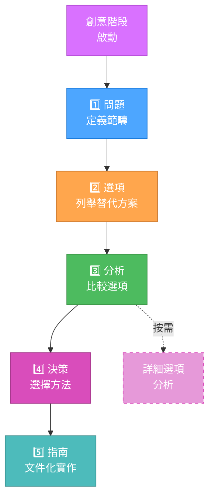
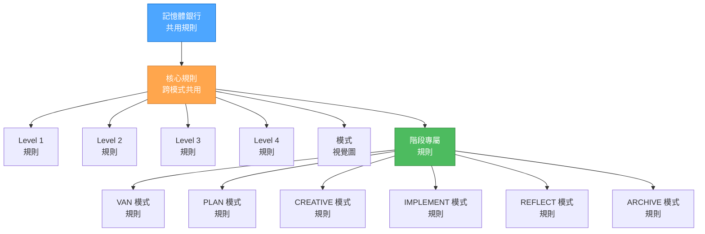

# 系統現況

> **重點摘要：** 記憶體銀行系統已進化為一個權杖最佳化、階層式架構，具備即時規則載入、漸進式文件，以及跨模式轉換時高效脈絡保留。

## 🎯 核心系統最佳化

### 1. 階層式規則載入

- 即時（JIT）載入專屬規則
- 跨模式轉換時核心規則快取
- 依複雜度選擇規則
- 權杖使用大幅減少

### 2. 漸進式文件

### 3. 最佳化模式轉換

- 統一脈絡轉移協議
- 標準化轉換文件
- 選擇性脈絡保留
- 模式間脈絡保留提升

### 4. 強化分級工作流程

- Level 1：極簡範本，快速修復
- Level 2：平衡四階段流程，簡化範本
- Level 3：最佳化創意階段探索
- Level 4：企業專案分層文件範本

### 5. 權杖最佳化架構

## 🔄 最佳化效率

### 模式專屬最佳化

1. **VAN 模式**

   - 以最小負擔高效判斷複雜度
   - 平台感知指令減少權杖消耗
   - 文件驗證流程精簡

2. **PLAN 模式**

   - 依複雜度規劃範本
   - 規劃細節漸進式揭露
   - 任務組織表格化

3. **CREATIVE 模式**

   - 漸進式文件與表格化比較
   - 創意探索「按需細節」
   - 高效選項分析範本

4. **IMPLEMENT 模式**

   - 實作指引精簡
   - 分級驗證流程
   - 狀態追蹤整合

5. **REFLECT/ARCHIVE 模式**
   - 脈絡感知檢討機制
   - 高效知識保存
   - 文件格式最佳化

### 脈絡管理改進

- 模式間統一脈絡轉移協議
- 關鍵資訊選擇性保留
- 差異化記憶體銀行更新以減少權杖消耗
- 模式專屬脈絡壓縮技術

## 📊 權杖效率提升

### 規則載入最佳化

- 階層式規則結構高效導覽
- 規則依賴追蹤避免重複載入
- 依複雜度條件載入規則
- 跨模式轉換規則快取

### 文件效率

- 複雜文件漸進式揭露
- 表格化高效選項比較
- 分級文件擴展
- 標準化範本減少重複內容

### 記憶體銀行最佳化

- 差異化更新減少權杖消耗
- 常用資訊脈絡壓縮
- 跨模式選擇性同步
- 結構化知識組織

## 🎯 目前重點

1. **架構精煉**

   - 微調階層式規則載入系統
   - 最佳化規則依賴與關聯
   - 強化自適應複雜度模型

2. **文件增強**

   - 各層級範本進一步最佳化
   - 改進表格化比較格式
   - 精煉漸進式文件方法

3. **脈絡保留**

   - 強化統一脈絡轉移協議
   - 提升轉換文件效率
   - 發展更佳脈絡修剪演算法

4. **整合增強**
   - 強化最佳化元件協調
   - 改進最佳化監控與指標
   - 發展更進階設定選項

## 🚀 下一步

1. **進階權杖最佳化**

   - 依任務特性動態產生範本
   - 長期任務自動脈絡摘要
   - 專屬規則檔案內部部分載入

2. **跨任務學習**

   - 類似任務間知識保存
   - 共用解決方案模式資料庫
   - 依歷史決策智能建議系統

3. **工作流程自動化**

   - 依任務狀態自動模式轉換
   - 依使用模式智能選擇規則
   - 流程中動態調整複雜度

4. **介面增強**
   - 互動式強化視覺流程圖
   - 進度追蹤與視覺化提升
   - 模式間轉換指引增強

系統已針對權杖效率大幅最佳化，同時保留原有結構化開發優勢。這些最佳化讓更複雜的專案能於權杖限制下高效處理，並帶來更佳用戶體驗。
