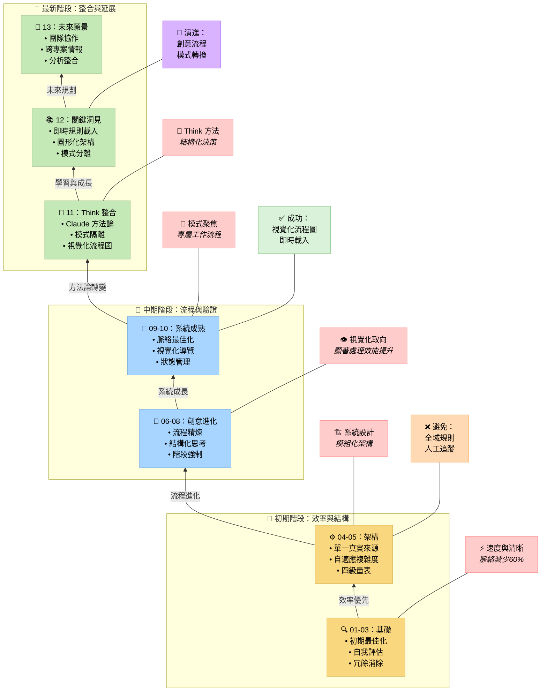

# 記憶體銀行系統：最佳化歷程

> **重點摘要：** 記憶體銀行系統經歷多輪最佳化，從初期效率提升到與 Claude「Think」工具的方法論整合。系統現已具備模式專屬隔離、視覺化流程圖，以及模組化架構，能在維持脈絡效率的同時，實現可延展、系統化開發。

## 📑 目錄

| 文件                                                                           | 說明                                        |
| ------------------------------------------------------------------------------ | ------------------------------------------- |
| [00-introduction.md](00-introduction.md)                                       | 系統簡介與目的                              |
| [01-efficiency-and-clarity.md](01-efficiency-and-clarity.md)                   | 最佳化第 1 輪：效率與清晰度                 |
| [02-system-self-assessment.md](02-system-self-assessment.md)                   | 最佳化第 2 輪：系統自我評估                 |
| [03-redundancy-elimination.md](03-redundancy-elimination.md)                   | 最佳化第 3 輪：冗餘消除                     |
| [04-single-source-of-truth.md](04-single-source-of-truth.md)                   | 最佳化第 4 輪：單一真實來源實作             |
| [05-adaptive-complexity-model.md](05-adaptive-complexity-model.md)             | 最佳化第 5 輪：自適應複雜度模型             |
| [06-self-assessment-recommendations.md](06-self-assessment-recommendations.md) | 最佳化第 6 輪：自評建議                     |
| [07-structured-creative-thinking.md](07-structured-creative-thinking.md)       | 最佳化第 7 輪：結構化創意思考               |
| [08-creative-phase-enforcement.md](08-creative-phase-enforcement.md)           | 最佳化第 8 輪：創意階段強制與指標           |
| [09-context-optimization.md](09-context-optimization.md)                       | 最佳化第 9 輪：透過視覺化導覽進行脈絡最佳化 |
| [10-current-system-state.md](10-current-system-state.md)                       | 系統現況                                    |
| [11-methodological-integration.md](11-methodological-integration.md)           | 與 Claude「Think」方法論整合                |
| [12-key-lessons.md](12-key-lessons.md)                                         | 重要經驗彙整                                |
| [13-future-directions.md](13-future-directions.md)                             | 未來方向與延展願景                          |

## 📋 最佳化歷程總覽

本文件詳述記憶體銀行系統的演進歷程，分為幾個關鍵階段：

### 初期最佳化（第 1-5 輪）

1. **效率與清晰度**：解決冗長問題並提升視覺層級
2. **系統自我評估**：加入驗證機制並強化追蹤
3. **冗餘消除**：建立集中任務登錄與領域分離
4. **單一真實來源**：實作任務追蹤的唯一來源
5. **自適應複雜度模型**：引入四級複雜度以因應不同任務

### 流程精煉（第 6-9 輪）

6. **自評建議**：強化創意階段處理並簡化流程
7. **結構化創意思考**：強制 Level 3-4 任務進行創意階段
8. **創意階段強制**：實作硬性關卡與品質指標
9. **脈絡最佳化**：新增選擇性文件載入與視覺化導覽

### 最新發展（第 10-13 輪）

10. **系統狀態評估**：全面檢視最佳化成果
11. **方法論整合**：與 Claude「Think」工具方法論對齊
12. **關鍵經驗彙整**：整合重要洞見
13. **未來方向**：延展與協作願景

## 🔍 最新系統成就

近期發展帶來顯著提升：

- **方法論整合**：與 Claude「Think」工具方法論對齊
- **模式隔離**：嚴格限制規則於特定模式內
- **視覺化流程圖**：完整指引開發階段
- **即時載入**：透過選擇性規則載入最佳化脈絡使用
- **圖形化架構**：高效決策樹導覽與資源最佳化

## 🧠 記憶體銀行系統核心原則

系統現維持以下強化核心原則：

1. **方法論基礎**：以驗證過的方法論為基礎的結構化流程
2. **模式專屬隔離**：透過專屬模式實現清晰職責分離
3. **視覺化處理**：完整的流程圖與決策樹
4. **即時效率**：僅於需要時載入所需內容
5. **持續進化**：定期評估並改進系統

## 發展階段總覽

### 初期聚焦（第 1-5 章）

- 建立效率原則基礎
- 發展系統化開發流程
- 建立核心架構與複雜度模型

### 中期階段（第 6-10 章）

- 精煉創意流程與強制機制
- 實作視覺化處理技術
- 達成顯著脈絡最佳化

### 最新階段（第 11-13 章）

- 與 Claude「Think」方法論整合
- 實作嚴格模式專屬隔離
- 建立未來延展願景

記憶體銀行系統持續以個人興趣專案進化，致力於打造結構化開發的強大工具，同時維持自始至終有效的四級複雜度量表核心。
